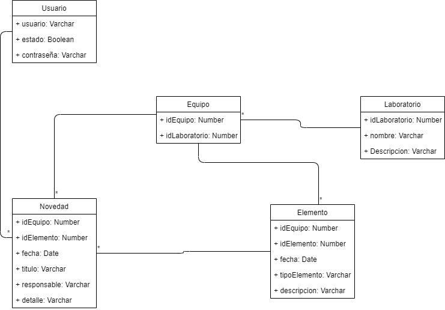
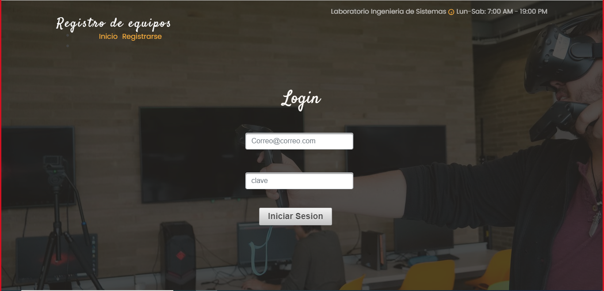
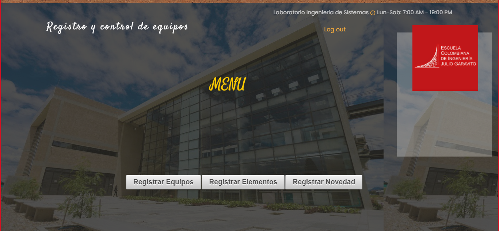
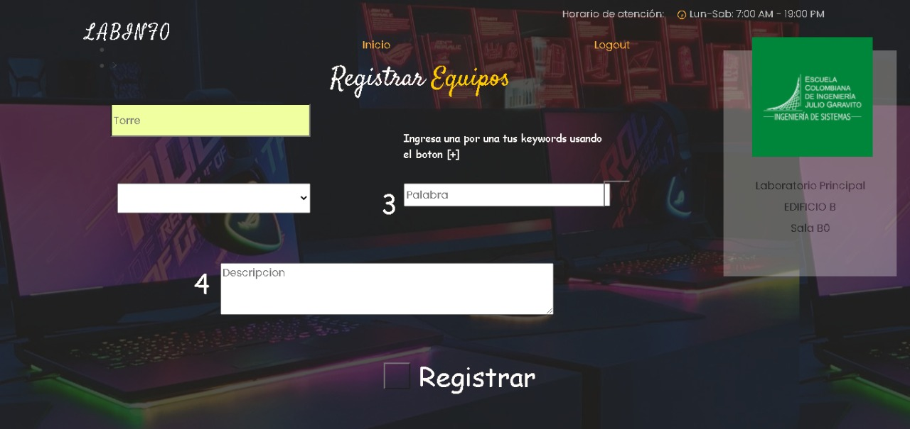
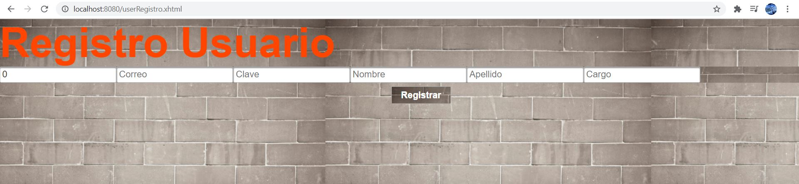

# 2020-2-PROYCVDS-3SD

# Escuela Colombiana de Ingeniería
#PROYECTO TERCER CORTE 
#AÑO 2020 - Segundo Semestre

**********************************************************
----------------------------------------------------------
**********************************************************
### Datos básicos
 * **Nombres:** Johan Sebastian Garcia\ 
				David Fernando Rivera\
				Janer Stiven Vanegas\
				Steven Ricardo Garzon Reina
				
				
**********************************************************
----------------------------------------------------------
**********************************************************


###INTRODUCCION
	La Plataforma Historial de Equipos, es una herramienta donde el personal del laboratorio de informática (LabInfo) pertenecientes a la decanatura de Ingeniería de Sistemas de la Escuela Colombiana de Ingeniería Julio Garavito, pueden registrar los laboratorio, equipos y elementos de cada equipo, junto con las novedades que se realizan a cada uno de estos. El sistema, más allá de facilitar el registro de los equipos y novedades, es una valiosa base de conocimiento donde el personal del laboratorio, puede revisar el histórico de novedades que se le han realizado a cada elemento a través del tiempo durante todo su ciclo de vida útil. El personal administrativo del laboratorio puede crear laboratorios, equipos y elementos, asociar unos a otros y registrar novedades para cada uno; además de tener una variedad de reportes que les permitirá tener el control administrativo de estos implementos.

###OBJETIVO
	El objetivo del sistema es permitir el registro y seguimiento de las novedades que han sido realizadas sobre los equipos de cómputo pertenecientes al Laboratorio de Informática. La plataforma de historial de equipos debe contar con una interfaz de usuario amigable con los usuarios.


**********************************************************
----------------------------------------------------------
**********************************************************
##ENTREGA #1
 * Desplegamos la aplicacion en Heroku.
 * Implementamos unas tareas pero en su totalidad el Sprint no esta terminado.
 * De lo anterior partimos y monstramos:
	1. Modelo de la base de datos.
		
	2. Inigio - Con su Login
		
	3. Menu 
		
	4. Registrar Equipos
		
	

**********************************************************
----------------------------------------------------------
**********************************************************

 * Nombre del proyecto
 # 2020-2-CVDS-3SD
 * Período académico, nombre del curso, nombre de los integrantes, nombre del profesor, roles asignados (no olvidar que el profesor tuvo el rol de 'dueño de producto').
 * **Periodo Academico:** 2020-2
 * **Nombre del curso:** Ciclos de vida y desarrollo de software
 * **nombre de los integrantes:** Steven Garzon, Stiven, David Rivera,Sebastian Garcia
 * **Profesor:** Julian Velasco
 ## Roles Asignados
 * **Julian Velasco** - *Product Owner*
 * **Sebastian Garcia** - *Developer*
 * **Steven Garzon** - *Developer*
 * **David Rivera** - *Scrum Master*
 * **Janer Stiven** - *Developer*

 ### Descripción del producto.
	* Descripción general.
	El objetivo del producto es mantener un orden sobre los laboratorios del programa de ingenieria de sistemas
	Los equipos que pertenecen a cada uno de estos laboratorios y los elementos que conforman los equipos, tambien
	de mantener al tanto por medio de novedades y reportes, al personal que los administre
 ## Manual de Usuario
 Lo primero que se tiene que hacer es registrarse en la plataforma en la ventana de registro de usuario 
 
 * Arquitectura y Diseño detallado:
	* Modelo E-R.
	* Diagrama de clases (hacerlo mediante ingeniería inversa)
	
	* Descripción de la arquitectura (capas) y del Stack de tecnologías utilizado (PrimeFaces, Guice, QuickTheories, PostgreSQL).
	* Enlace a la aplicación en Heroku.
		```https://proyecto-cvds-3sd.herokuapp.com/```
		
	* Enlace al sistema de integración continua.
 * Descripción del proceso:
	* Integrantes.
				Johan Sebastian Garcia\ 
				David Fernando Rivera\
				Janer Stiven Vanegas\
				Steven Ricardo Garzon Reina
	* Breve descripción de la Metodología.
	* Enlace a Taiga (hacer público el Backlog).
	* Generar el 'release-burndown chart' del proyecto, e indicar los puntos de historia realizados y los faltantes.
	* Para cada Sprint:
		* Imagen del 'sprint-backlog'
		* Imagen del 'sprint-burndown chart' (sacado del sprint-backlog anterior), y una descripción breve de los problemas encontrados y mejoras realizadas al proceso.
	* Reporte de pruebas y de cubrimiento de las mismas (sólo la foto del reporte principal). Para la cobertura, pueden usar los plugins disponibles (EclEmma, Jacoco, etc.)
	* Reporte de análisis estático de código. Se pueden usar las mismas herramientas trabajadas en los laboratorios.
